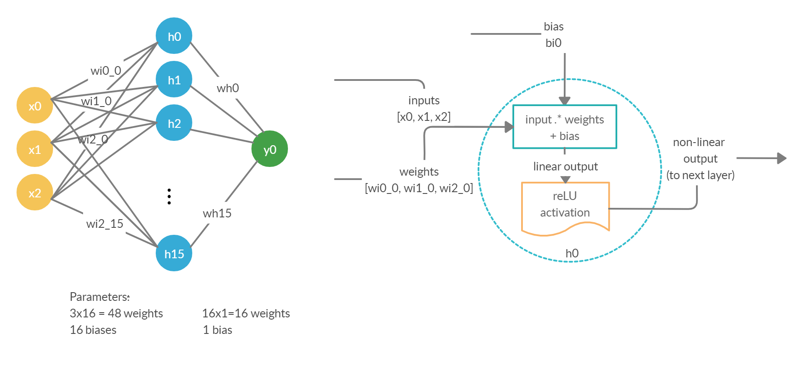

# KNN
This notebook demonstrates how to download a dataset from data.gov.sg. How to formulate a Machine Learning problem for forecasting and train a simple Neural Network to predict the next value.

Keras is compatible for Python up to 3.6. As I am using Python version 3.7 on my machine, I solved the issue by using colab in this repository. There is no need to install Keras and everything else is already preinstalled. Its my first time using colab. 

Thanks for reading!
:blush:
